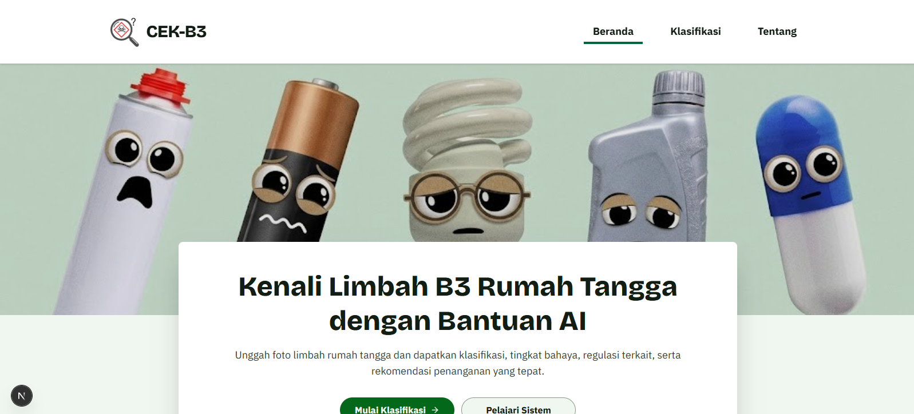

# CEK-B3 Frontend

Frontend web interaktif untuk **Sistem Identifikasi Limbah B3 Rumah Tangga** berbasis AI. Aplikasi ini dirancang modern, cepat, dan interaktif menggunakan model *Deep Learning* (MobileViT) di sisi backend untuk mengklasifikasikan jenis limbah dan menyajikan visualisasi Grad-CAM kepada pengguna.



## Fitur Utama

- **Multi-Input Gambar:** Dukungan untuk Upload File (drag & drop), tangkapan Web-Kamera Langsung, dan pilihan Contoh Dataset.
- **Pengecekan Kualitas Cerdas (Pre-flight):** Mengecek gambar terlalu buram (blur) atau overexposed secara langsung di sisi *client* menggunakan HTML5 Canvas.
- **Visualisasi Grad-CAM:** Menampilkan *heatmap* AI secara bersebelahan dengan gambar asli untuk transparansi keputusan model.
- **Mode Edukasi & Teknis:** Toggle antara tampilan regulasi teknis dengan tampilan ramah lingkungan yang mengedukasi dampak kesehatan dan lingkungan limbah.
- **Riwayat Klasifikasi Otomatis:** Sistem menyimpan 10 hasil prediksi terakhir beserta *thumbnail* secara lokal (*local storage*) tanpa membebani database.
- **Sistem Feedback:** Fitur pengumpulan respons benar/salah dari pengguna untuk evaluasi riset model AI.

## Teknologi

- **Framework:** Next.js (App Router) & React 19
- **Styling:** Tailwind CSS (Vanilla CSS & CSS Variables)
- **Animasi:** Framer Motion (Transitions, Layout Animations, SVG draw)
- **Ikonografi:** Lucide React

## Cara Menjalankan secara Lokal

### 1. Instalasi Dependensi
Pastikan Node.js sudah terinstal, lalu jalankan:
```bash
npm install
```

### 2. Konfigurasi Environment
Buat file `.env` di folder `frontend`. Anda bisa menyalin format dari `.env.example`:
```bash
cp .env.example .env
```
Lalu, buka file `.env` dan isi URL API backend Anda (Misal URL Hugging Face Spaces):
```env
NEXT_PUBLIC_API_BASE_URL="https://username-cekb3-backend.hf.space"
# Opsional, jika backend memerlukan autentikasi
NEXT_PUBLIC_API_KEY="API_KEY_ANDA"
```

### 3. Jalankan Server Development
Jalankan perintah ini untuk memulai server:
```bash
npm run dev
```
Buka peramban (browser) dan akses `http://localhost:3000`.

---
*Dibuat untuk penelitian klasifikasi limbah B3 menggunakan arsitektur MobileViT.*
# CekB3-Frontend
